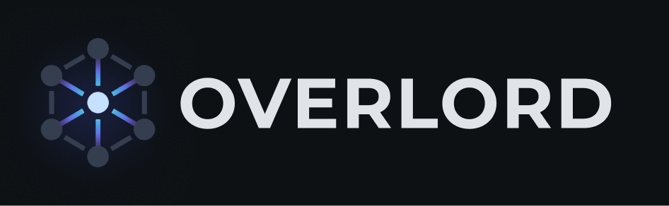

<p align="center">
  
</p>

# Overlord

A local web-based project multiplexer with integrated Claude AI agents. Manage multiple projects, chat with Claude in the context of each project, track todos, and run terminals from one interface.

## Features

- **Multi-project management** lets you scan a directory for git repositories and switch between them instantly.
- **Claude AI chat per project** gives each project its own Claude conversation scoped to that codebase, with streaming responses and tool access.
- **Todos / Backlog** tracks ideas and tasks per project, then lets you launch them directly into the chat.
- **Integrated terminal access** opens your preferred terminal application in the selected project's directory.
- **Monorepo support** detects workspace packages from pnpm, yarn, npm workspaces, nx, and lerna.
- **Persistent state** keeps chat history, todos, and project settings across server restarts with SQLite.
- **MCP server support** lets Claude agents read and write Overlord todos through the MCP protocol.
- **Auto-summaries** generate project summaries automatically after conversations.

## Prerequisites

- [Node.js](https://nodejs.org/) >= 18
- [Claude Code CLI](https://docs.anthropic.com/en/docs/claude-code) installed and authenticated

## Quick Start

```bash
# Clone the repo
git clone https://github.com/poptocrack/overlord.git
cd overlord

# Install dependencies (also installs and configures RTK automatically)
npm install

# Start the dev server (backend + frontend)
npm run dev

# Open http://localhost:4748 in your browser
```

`npm install` automatically sets up [RTK](https://github.com/rtk-ai/rtk) (Rust Token Killer) which reduces token consumption by 60-90% for Claude agents. If you prefer to skip this, set `RTK_SKIP=1` before installing.

On first launch, click **"Scan projects"** in the sidebar to detect git repositories.

## Configuration

### Root Directory

By default, Overlord scans the **parent directory** of where the server is running. To scan a different directory:

```bash
OVERLORD_ROOT=/path/to/your/projects npm run dev
```

For example:
```bash
# Scan ~/Projects instead of the default
OVERLORD_ROOT=~/Projects npm run dev
```

### Port

The backend runs on port `4747` and the frontend dev server on `4748`. To change:

```bash
PORT=5000 npm run dev
```

### Claude CLI Path

If `claude` is not in your PATH:

```bash
CLAUDE_PATH=/path/to/claude npm run dev
```

## Project Structure

The `server/` directory contains the Hono backend, SQLite setup, routes, WebSocket handling, MCP integration, and Claude agent orchestration.

The `src/` directory contains the React frontend, including the main layout, sidebar, chat, todos, settings, skills, summaries, and reusable UI components.

The `bin/overlord.js` file is the CLI entry point, while `package.json` defines scripts and dependencies.

## Tech Stack

| Layer | Technology |
|-------|-----------|
| Frontend | React, Vite, Tailwind CSS v4, shadcn/ui |
| Backend | Hono, Node.js |
| Database | SQLite via better-sqlite3 + Drizzle ORM |
| AI | Claude Code CLI (`--print --output-format stream-json`) |
| Token optimization | [RTK](https://github.com/rtk-ai/rtk) (60-90% token savings on shell commands) |
| Protocol | WebSocket (chat streaming), MCP |

## Scripts

```bash
npm run dev          # Start backend + frontend (hot reload)
npm run dev:server   # Backend only (with watch)
npm run dev:client   # Frontend only
npm run build        # Production build
```

## Data Storage

All data is stored in `~/.overlord/overlord.db` (SQLite). This includes:
- Project registry (scan results, favorites, hidden state)
- Chat conversations and messages
- Todos
- Auto-generated summaries

The database is created automatically on first run.

## License

MIT
